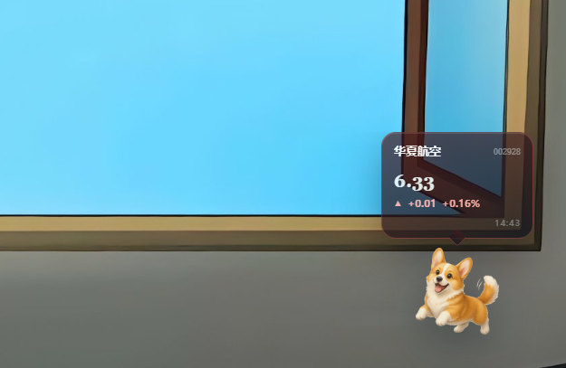
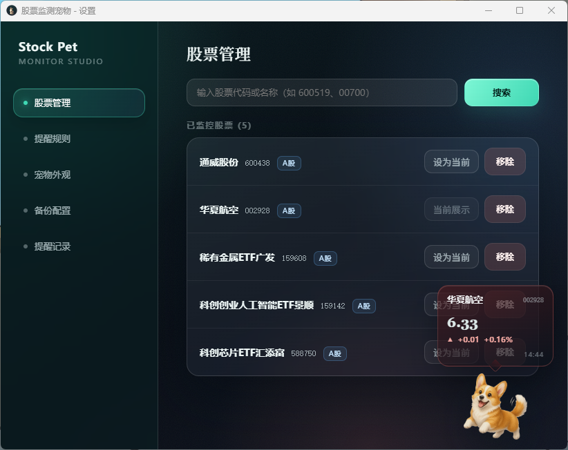
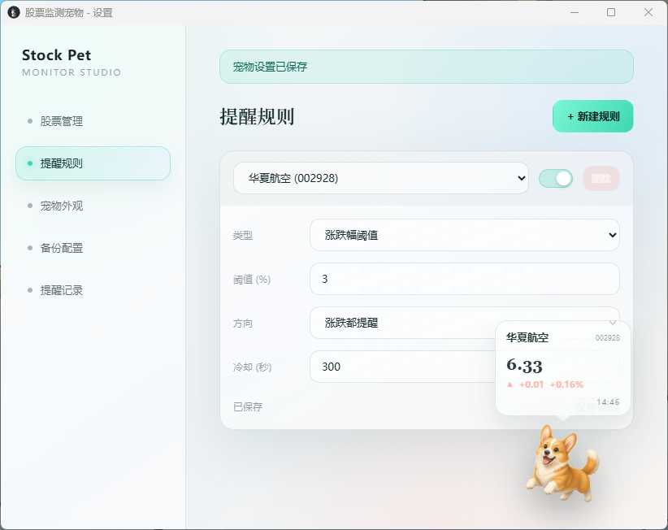
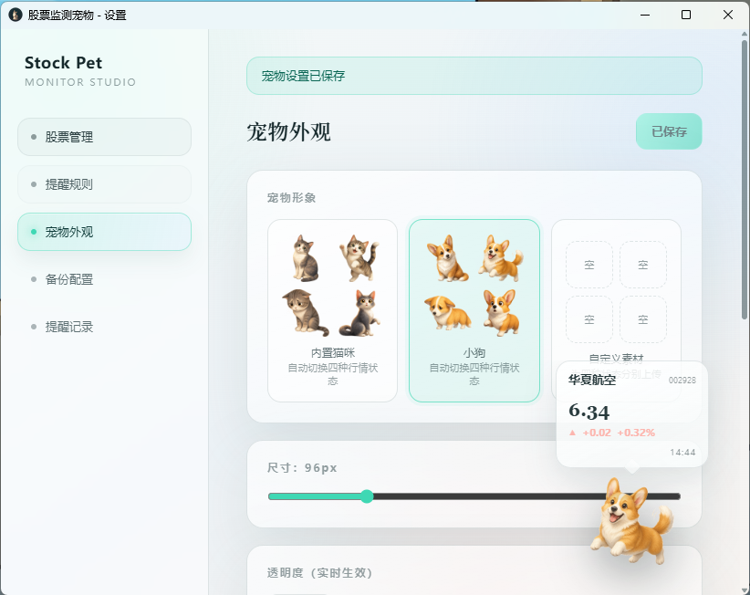
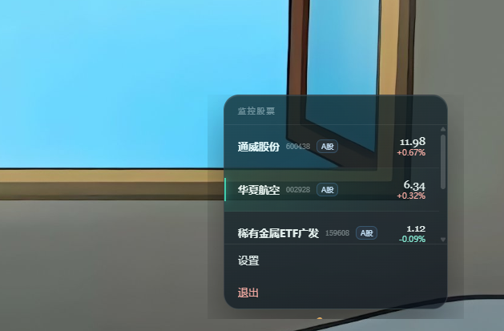

# PawTrader · 桌面股票盯盘宠物

PawTrader 是一款开源跨平台桌面宠物。它以一只安静的小猫或小狗常驻桌面，按你设置的间隔刷新 A 股、港股、美股、场内基金/ETF 和国际黄金行情，用气泡展示涨跌，并在触发提醒规则时通知你。




## 功能亮点

- **桌面伴侣**：猫咪 / 小狗皮肤，随行情切换「上涨 / 下跌 / 横盘 / 提醒」状态，还会偶尔散步。
- **行情气泡**：实时展示当前股票的价格、涨跌额、涨跌幅和更新时间；右键可快速切换股票。
- **休市快照**：周末、节假日和收盘后不再高频轮询，但会显示最近收盘价格，避免误以为没有股票。
- **市场覆盖**：支持 A 股、港股、美股、国际黄金（`XAUUSD`），也支持场内基金 / ETF，例如 `159142`、`510300`。
- **提醒系统**：支持涨跌幅、价格上穿 / 下穿、短时快速异动；触发时播放提示音、发送系统通知，并保留提醒历史。
- **交易时段识别**：周末、节假日、午休和市场休市自动暂停轮询。
- **行情容灾**：腾讯行情为主源，自动重试并在 HTTPS / HTTP 间回退；失败后切换新浪财经备用源。每轮刷新仅发起一次行情请求。
- **外观与本地化**：暗色 / 浅色玻璃拟态界面，中英文切换，支持大小、透明度、置顶与刷新间隔调整。
- **配置迁移**：一键导出 / 导入股票、规则、外观和语言设置，方便升级、重装与迁移。
- **本地优先**：无账号、无云服务，配置只保存在本机。

## 界面预览

### 股票管理

输入名称或代码搜索，添加后可直接移除，或将任意一只股票设为当前展示。



### 提醒规则

规则支持修改后单独保存，也支持删除和启用 / 停用。



### 外观设置

可调整宠物大小、透明度、刷新间隔、置顶行为、皮肤、语言和主题。



### 右键监控列表

右键宠物查看所有监控标的和行情，点击条目即可切换气泡。



## 下载安装

前往 [Releases](https://github.com/konka0812/stock-monitor-pet/releases) 下载最新版本：

| 平台 | 安装包 |
| --- | --- |
| Windows x64 | `PawTrader_x64-setup.exe` |
| macOS Apple Silicon | `PawTrader_aarch64.dmg` |
| macOS Intel | `PawTrader_x64.dmg` |
| Linux | `PawTrader .AppImage` / `.deb` / `.rpm` |

> 项目暂未做商业签名。Windows SmartScreen 和 macOS Gatekeeper 可能提示“未知开发者”，请选择“仍要运行”或在系统设置中允许打开。

## 快速上手

1. 启动后右键宠物，选择「设置」。
2. 在「股票管理」搜索并添加标的，例如 `600519`、`00700`、`AAPL`、`XAUUSD`。
3. 在「提醒规则」创建阈值或异动规则，修改后点击「保存修改」。
4. 在「宠物外观」调整尺寸、透明度、皮肤、语言和主题。
5. 右键宠物即可查看监控列表，点击股票切换当前气泡。

## 快捷键

| 快捷键 | 作用 |
| --- | --- |
| `Ctrl+Shift+←` | 切换上一只股票 |
| `Ctrl+Shift+→` | 切换下一只股票 |
| `Ctrl+Shift+P` | 切换下一只股票 |

> 当前快捷键作用于宠物窗口获得焦点时；系统级全局快捷键会在后续版本继续补齐。

## 本地开发

需要 Node.js 22+、Rust stable，以及 Tauri 2 对应平台依赖：

- Windows：WebView2
- macOS：Xcode Command Line Tools
- Linux：`webkit2gtk-4.1` 等系统库

```bash
npm install
npm run tauri dev      # 开发调试
npm run tauri build    # 构建当前平台安装包
```

验证前端与 Rust：

```bash
npm run build
cd src-tauri
cargo test
```

## 行情来源与限制

- 主源使用腾讯公开行情接口，备源使用新浪财经行情接口；两者均不需要 API Key。
- 请求由每个用户自己的电脑和网络出口直连行情接口，不存在共享额度或账号额度。
- 公开行情接口不是面向第三方商业或大规模采集的官方 API，没有 SLA；高频请求可能被限流或封禁 IP。
- 默认刷新间隔为 60 秒，建议不要低于 15 秒；请勿监控过多标的或将本程序用于数据批量采集。
- 行情可能有延迟，仅供个人看盘参考，不构成投资建议。

## 项目结构

```text
.
├── src/
│   ├── components/pet/       # 宠物、气泡、右键菜单
│   ├── components/settings/  # 设置界面
│   ├── services/             # Tauri 命令封装
│   ├── i18n/                 # 中英文文案
│   └── assets/pet/           # 内置宠物素材
├── src-tauri/
│   ├── src/quote/            # 腾讯 / 新浪行情与容灾
│   ├── src/alert/            # 提醒规则引擎
│   ├── src/models/           # 数据模型
│   └── src/storage/          # 本地持久化
├── settings.html             # 设置窗口入口
├── images/                   # README 截图
└── .github/workflows/        # 三平台构建发布
```

## 技术栈

- [Tauri 2](https://tauri.app/) + Rust：原生窗口、透明置顶、单实例、托盘化桌面体验
- React 19 + TypeScript + Vite：设置界面与宠物交互
- Reqwest：行情请求、重试、HTTPS / HTTP 回退与 GBK 解码

## 常见问题

### 启动旧版本时出现 `state not managed for field 'state' on command get_stocks`？

这是旧版本的初始化时序问题。请完全退出旧进程后，安装 `v0.4.0` 或更新版本；`v0.4.2` 已继续增强数据初始化兼容性。

### Windows 设置窗口黑屏 / 卡死？

请先在任务管理器中结束旧的 `Stock Monitor Pet` 或 `PawTrader` 进程，再安装 `v0.4.0+`。`v0.4.0+` 已将设置窗口改为独立页面，并使用异步命令创建，避免 Windows 主线程卡死。

### 搜索 `XAUUSD` 报错？

请升级到 `v0.4.2`。该版本修复了搜索结果返回 `hf_XAU` 后又被误识别为美股符号的问题。

### 自定义素材支持什么格式？

支持 PNG / GIF / WebP，单张不超过 3MB。建议使用透明背景，并分别上传上涨、下跌、横盘、提醒四种状态。

### 如何保留或迁移配置？

在「备份配置」导出 JSON；重装或升级后导入即可。旧版配置会尽量自动兼容。

### 数据保存在哪里？

保存在系统应用数据目录下的 `com.knoka.stockpet`：

- Windows：`%APPDATA%/com.knoka.stockpet`
- macOS：`~/Library/Application Support/com.knoka.stockpet`
- Linux：`~/.local/share/com.knoka.stockpet`

## 贡献

欢迎提交 Issue、PR 和设计建议。提交前请运行：

```bash
npm run build
cd src-tauri && cargo test
```

## License

[MIT](LICENSE)
